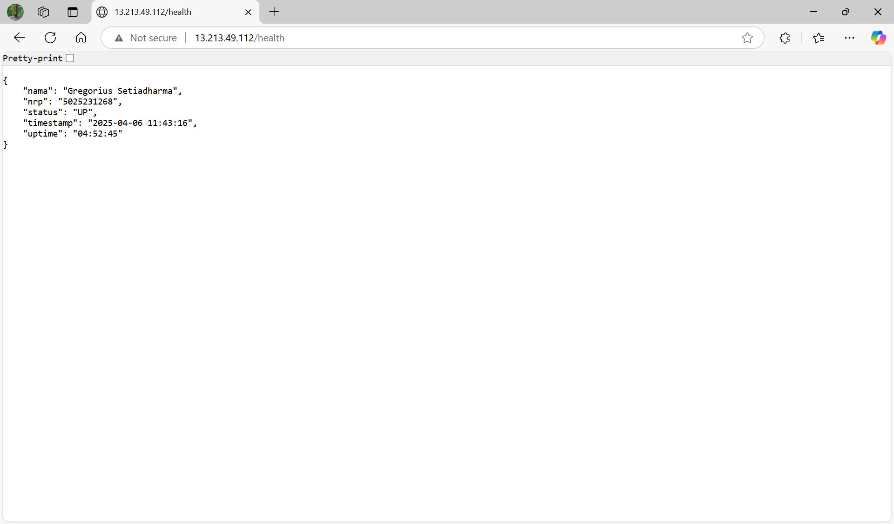
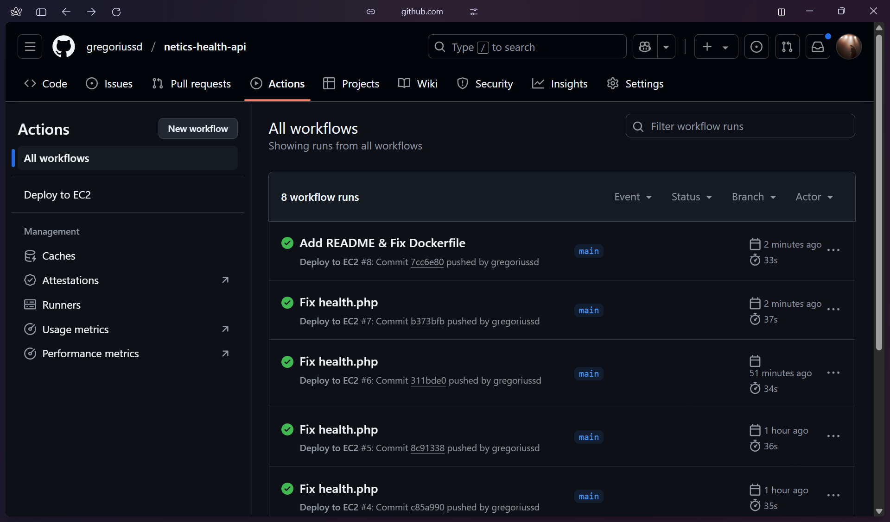

# Laporan Penugasan Modul 1
### Oprec NETICS 2025

URL API: http://13.213.49.112/health  
Screenshot Hasil:  
  


## Overview

Pada penugasan modul 1 kita diminta untuk mengimplementasikan CI/CD pada sistem server sedarhana. Pada server kita diminta untuk membuat API publik dengan endpoint /health untuk menampilkan informasi sebagai berikut:  
```
{
  "nama": "nama",
  "nrp": "nrp",
  "status": "UP",
  “timestamp”: time	    // Current time
  "uptime": time		// Server uptime
}
```

## Pembuatan API
Endpoint API pada project ini dibuat menggunakan PHP sederhana dan dibangun pada VPS menggunakan layanan Amazon Web Services Elastic Cloud Compute (EC2). Untuk setup VPS menggunakan EC2 tidak akan dijelaskan lebih lanjut. Selanjutnya akan dijelaskan kode file health.php sebagai endpoint API pada project ini.


### Penjelasan health.php:

#### 1.Memastikan URI
```php
<?php
if ($_SERVER['REQUEST_URI'] !== '/health') {
    http_response_code(404);
    exit;
}
```
Karena endpoint yang diinginkan adalah /health maka rewrite module dimanfaatkan untuk mengarahkan request menuju file health.php. Maka request URI selain /health tidak akan diterima oleh health.php hal ini termasuk URI /health.php. Bagian di atas merupakan tambahan yang bersifat opsional.  

#### 2.Tambahkan header JSON
```php
header('Content-Type: application/json');
```
Tambahkan header untuk membertahu bahwa output berupa JSON.  

#### 3.Dapatkan dan format uptime:
```php
$uptime = shell_exec("awk '{print $1}' /proc/uptime");
$uptime_formatted = gmdate("H:i:s", (int) $uptime);
```
Untuk mendapatkan uptime dimanfaatkan file /proc/uptime. Di dalam file tersebut terdapat 2 value yaitu uptime dan idle time dalam detik. Karena kita hanya ingin mengambil uptime maka valie pertama diambil menggunakan awk. Kemudian uptime dalam detik diformat menjadi hour minute second menggunakan gmdate.  

#### 4.Outputkan data yang diminta dalam format JSON
```php
echo json_encode([
    "nama" => "Gregorius Setiadharma",
    "nrp" => "5025231268",
    "status" => "UP",
    "timestamp" => date("Y-m-d H:i:s"),
    "uptime" => $uptime_formatted
], JSON_PRETTY_PRINT);
```
Gunakan JSON encode untuk mengoutputkan data-data yang diminta dalam format JSON. Untuk nama, nrp, dan status gunakan nilai yang sudah ditentukan. Sementara untuk timestamp gunakan fungsi date() dan untuk uptime gunakan variabel uptime_formatted. Untuk JSON_PRETTY_PRINT merupakan tambahan untuk memastikan output selalu ditampilkan menggunakan pretty print.  
  
Kemudian agar health.php dapat diakses pada URI /health maka dimanfaatkan rewrite module pada php maka dari itu diperlukan file .htaccess berikut:
```
RewriteEngine On
RewriteRule ^health$ health.php [L]
```
Pada .htaccess pertama nyalakan rewrite engine kemudian set rule bahwa jika ditemukan URI /health maka arahkan ke file health.php.  
  
## Containerization (Docker Multi-stage)
Soal meminta kita untuk melakukan kontainerisasi proses deployment API memanfaatkan Docker Multi-stage. Maka untuk itu diperlukan Dockerfile sebagai berikut:  
#### 1.Stage 1: Build
```Dockerfile
# build
FROM php:8.2-cli AS build

WORKDIR /app
COPY public/ /app/
```
Tahap build menggunakan base yang ringan yaitu php:8.2-cli. Dengan base ini kita akan membuat direktori app dan akan mengambil isi dari direktori public.

#### 1.Stage 2: Production
```Dockerfile
FROM php:8.2-apache

RUN a2enmod rewrite

COPY --from=build /app /var/www/html

RUN sed -i 's/AllowOverride None/AllowOverride All/g' /etc/apache2/apache2.conf

EXPOSE 80
```
Tahap production menggunakan base yang dibutuhkan yaitu apache. Kemudian jalankan module rewrite (dibutuhkan untuk mengatur URI /health seperti dijelaskan sebelumnya). Salin isi dari dorektori app yang ada pada build ke dalam direktori /var/www/html. Atur pengaturan apache2.conf untuk mengizinkan override menggunakan substitute pada perintah sed. Terakhir lakukan expose untuk port 80 yaitu port default untuk HTTP.  

### DISCLAIMER:
Sesungguhnya multistage tidak dibutuhkan pada kasus ini sebab program yang dibuat sanagt sederhana. Multistage mungkin akan dibutuhkan jika PHP yang digunakan menggunakan basis framework seperti Laravel atau sebagainya.  

## CI/CD Implementation using GitHub Actions
Untuk implementasi CI/CD pada projek ini sangat sederhana dimana CI/CD digunakan untuk melakukan satu job yaitu otomatisasi deployment ke dalam VPS EC2. Trigger yang dimanfaatkan adalah __*PUSH*__. Untuk melakukan konfigurasi CI/CD diperlukan file .yaml yang diletakan pada directory .github/workflows. Pada proyek ini konfigurasi diletakan pada file deploy.yaml.

### Konfigurasi deploy.yaml
#### 1.Nama workflow
```yaml
name: Deploy to EC2
```

#### 2.Setup Trigger
```yaml
on:
  push:
    branches:
      - main
```
Mengatur trigger untuk mengaktifkan workflow saat terdeteksi push pada main branch.  

#### 3.Inisialisasi Job
```yaml
jobs:
  deploy:
    runs-on: ubuntu-latest
```
Inisialisasi job yaitu job deploy yang berjalan pada ubuntu (menyesuaikan VPS).  

#### 4.Step 1: Clone repository ke dalam workspace
```yaml
    steps:
    - name: Checkout repo
      uses: actions/checkout@v3
```
Repository akan di clone ke dalam workspace sementara dari CI/CD dengan memanfaatkan checkout version 3.  

#### 5.Step 2: Copy repository ke dalam VPS EC2
```yaml
    - name: Copy files to EC2 via SSH
      uses: appleboy/scp-action@v0.1.4
      with:
        host: ${{ secrets.HOST }}
        username: ${{ secrets.USER }}
        key: ${{ secrets.SSH_KEY }}
        source: "."
        target: "~/netics-health-api"
```
Salin semua file yang ada pada repository ke dalam EC2 dengan memanfaatkan appleboy/scp-action version 0.1.4. Penyalinan ini dilakukan via SSH maka dari itu diperlukan host, username, dan key yang diletakan pada GitHub secrets. File hasil salinan diletakan pada direktory ~/netics-health-api.  

#### 6.Step 3: Jalankan perintah deployment pada EC2
```yaml
    - name: Run deployment commands on EC2
      uses: appleboy/ssh-action@v0.1.10
      with:
        host: ${{ secrets.HOST }}
        username: ${{ secrets.USER }}
        key: ${{ secrets.SSH_KEY }}
        script: |
          cd ~/netics-health-api
          docker build -t netics-health-api .
          docker stop netics-api || true && docker rm netics-api || true
          docker run -d -p 80:80 --name netics-api netics-health-api
```
Masuk ke dalam EC2 menggunakan SSH dengan memanfaatkan appleboy/ssh-action version 0.1.10. Kemudian jalankan perintah yang dituliskan pada bagian script. Perintah yang dijalankan yaitu:  
    1. Masuk ke dalam directory netics-health-api.  
    2. Build docker image dengan menggunakan Dockerfile pada netics-health-api.  
    3. Hapus hentikan dan hapus container terdahulu (jika ada).  
    4. Jalankan container baru sesuai image hasil docker build.  
  
Jika konfigurasi berhasil maka setiap melakukan push ke dalam repository akan terdapat workflow yang berjalan. Hal ini dapat di cek pada tab Actions pada repository.  
  

### Penjelasan GitHub Secrets
Terdapat 3 GitHub secrets yang digunakan yaitu:
    1. HOST : berisi hostname alias public IP untuk mengakses VPS  
    2. USER : berisi username yang digunakan untuk mengakses VPS (menggunakan username default "ubuntu")  
    3. SSH_KEY : berisi RSA key untuk mengakses VPS menggunakan SSH didapatkan dari keypair yang dibuat pada saat konfigurasi EC2.  